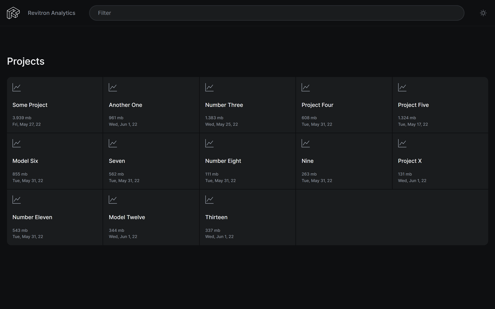
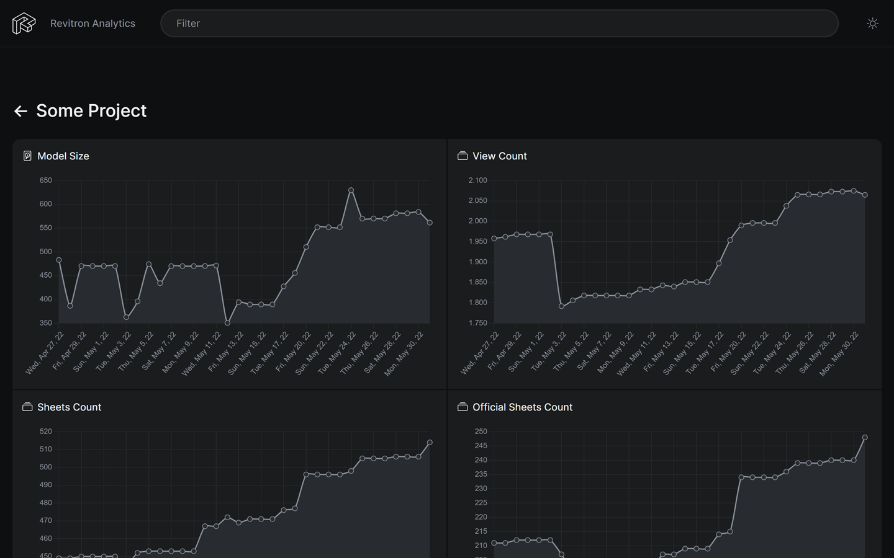

# Revitron Charts

The Revitron Charts app is a frontend for model analytics data that are collected using the `revitron analyze` command in combination with a Directus instance as the storage. It basically automatically grabs all collections from a Directus instance and auto-generates the respective charts.




## Configuration

Revitron Charts requires a couple of specific environment variables to be defined in order to connect to a running Directus instance and work properly.

| Name | Description |
| :--- | :--- |
| RC_API_KEY | The API key that is used to athenticate requests to the Directus endpoints |
| RC_API_URL | The base URL of the Directus instance |
| RC_DISPLAY_UNIT | The base unit for displaying numeric values &mdash; `feet` or `meter` (defaults to `feet`) |

### Configuration File

Instead of environment variables it is also possible to configure the app using a configuration file with the path `config/config.php` relative to the root of this repository. Note that there is already a `config/defaults.php` file [in place](config/defaults.php) that can be renamed and used as a template.

```php
<?php

return array(
    'RC_API_KEY' => 'XXX',
    'RC_API_URL' => 'https://url/to/directus',
    'RC_DISPLAY_UNIT' => 'meter'
);
```

## Docker

The easiest way of getting the charts dashboard up and running is to use Docker, since no further setup of a webserver that handles PHP files is required. However it is required to be familiar with hosting Docker containers in a local network.

### Building the Image

In order to build the Docke image, simply clone it into some temporary directory and use the `build` command.

```bash
git clone https://github.com/revitron/revitron-charts.git .
docker build -t revitron/charts .
```

### Run the Container

After successfully building the image, we can now run it and pass the required environment variables:

```bash
docker run -d \
           -p 80:80 \
           -e RC_API_KEY="XXX" \
           -e RC_API_URL="https://url/to/directus" \
           -e RC_DISPLAY_UNIT="meter" \
           --name revitron \
           revitron/charts
```